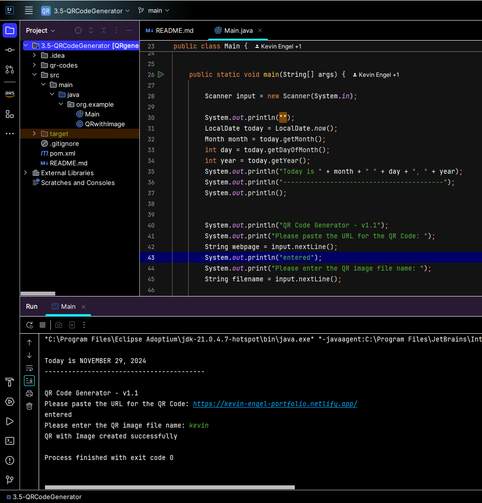

# QR Code Generator

Java CLI app to create a QR code 

This application uses the **Zebra Crossing (ZXing)** library for QR code generation and scanning.

**Library:** [ZXing (Zebra Crossing)](https://github.com/zxing/zxing)  
**Version:** 3.5.5

The app adds a small logo in the center of the code

## Code block to be incorportated into the HomeInventoryApp

Uses for major appliance: warranty, maintainance records, service urls, user manuals, etc...

## Sample Screenshot

